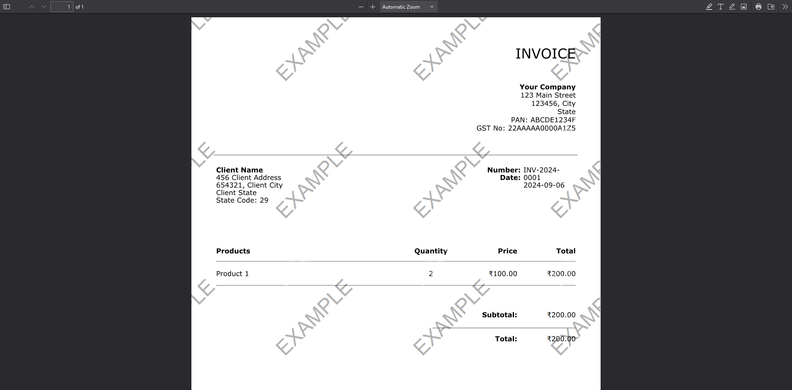

# Invoice Pdf Generate

Develop a programmatic way of generating an invoice for orders placed on an e-commerce platform.

## Tools & Libraries:

- Express.js: To handle the API endpoints.
- Easyinvoice: To generate the invoice in the required format and create a PDF.
- Joi: Library for validating input parameters.

## Basic Workflow:

- Setup Express.js Server: Create API routes that accept order data (seller details, billing info, item list, etc.).
- Process Input Data: Validate and structure the data, compute tax types, amounts, and total values.
- Generate Invoice:
  Use Easyinvoice to create the invoice with structured data.
  Optionally use PDFKit to generate a custom PDF if you're not using Zoho.
- Compute Values:
  Calculate Net Amount, Tax Amount (SGST/CGST or IGST), and Total Amount.
  Convert total amounts to words.
- Generate Invoice in PDF Format: Send the invoice back as a downloadable PDF file.

## Set up Locally:

- `git clone https://github.com/ankkitsharma/invoice-pdf-generate.git`
- `cd invoice-pdf-generate`
- create .env with following value: `PORT = 3000`
- `npm install express easyinvoice joi cors`
- start localhost with: `npm start`

## Test the endpoints:

- Use the endpoint: http://localhost:3000/invoice/generateInvoice (or replace the local part with the deployed link)
- Select POST METHOD
- Select Content-Type as application/json in Request Headers
- Enter the following example raw Body:
  `    {
    "sellerDetails": {
        "name": "Your Company",
        "address": "123 Main Street",
        "city": "City",
        "state": "State",
        "pincode": "123456",
        "panNo": "ABCDE1234F",
        "gstNo": "22AAAAA0000A1Z5"
    },
    "placeOfSupply": "State",
    "billingDetails": {
        "name": "Client Name",
        "address": "456 Client Address",
        "city": "Client City",
        "state": "Client State",
        "pincode": "654321",
        "stateCode": "29"
    },
    "shippingDetails": {
        "name": "Client Name",
        "address": "456 Client Address",
        "city": "Client City",
        "state": "Client State",
        "pincode": "654321",
        "stateCode": "29"
    },
    "placeOfDelivery": "Client State",
    "orderDetails": {
        "orderNo": "12345",
        "orderDate": "2024-09-06"
    },
    "invoiceDetails": {
        "invoiceNo": "INV-2024-0001",
        "invoiceDate": "2024-09-06",
        "reverseCharge": false
    },
    "items": [
        {
            "description": "Product 1",
            "unitPrice": 100,
            "quantity": 2,
            "discount": 0,
            "taxRate": 18
        }
    ],
    "signature": "path/to/signature.png"
}`
- Hit send and the invoice.pdf will be generated in the main folder of the server and also sent as response.
- Screenshot:
  
